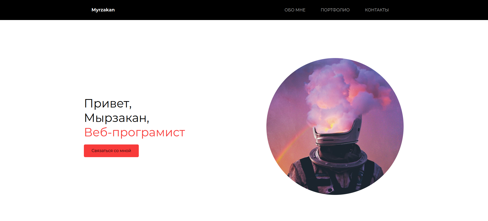

# Демонстрационное портфолио (Demo Portfolio)



Этот проект представляет собой демонстрационное портфолио для веб-разработчика и предназначено для отображения вашей работы, навыков и контактной информации.
Описание

Демонстрационное портфолио разработано с использованием HTML и CSS для создания структуры и внешнего вида веб-сайта. Оно включает в себя разделы "Обо мне", "Мои работы" и "Контакты", чтобы предоставить посетителям полную информацию о вас и вашей работе.
Функциональность

  - Обо мне: В этом разделе можно найти краткую информацию о вас, вашем опыте и навыках. Это помогает посетителям узнать вас лучше.

  - Мои работы: Здесь вы можете демонстрировать свои проекты, визуализируя их с помощью изображений и предоставляя ссылки на дополнительную информацию о каждом проекте.

  - Контакты: Раздел, который предоставляет форму для связи с вами. Посетители могут отправить вам сообщение через эту форму.

# Структура проекта

  - index.html: Главная страница портфолио.
  - css/style.css: Файл со стилями для внешнего вида портфолио.
  - img/: Папка с изображениями, используемыми в портфолио.
  - README.md: Этот файл, содержащий информацию о проекте.

# Как использовать

  Клонируйте репозиторий на свой локальный компьютер:

  ```bash

    git clone git@github.com:myrzakan/Portfolio.demo.git
  ``````

Откройте файл index.html в вашем веб-браузере для просмотра и использования демонстрационного портфолио.

Этот README файл предоставляет основную информацию о демонстрационном портфолио (Demo Portfolio). После клонирования репозитория и настройки проекта, вы можете начать использовать его для демонстрации ваших навыков и проектов. Удачи!